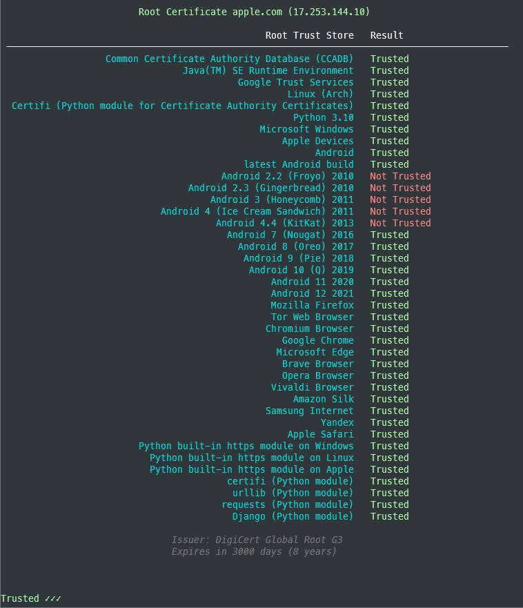

# Command Line

First get [pipx](https://packaging.python.org/key_projects/#pipx) for [better python command line tool installs](https://packaging.python.org/guides/installing-stand-alone-command-line-tools/)

Install python 3.9+

Then install `tlstrust` as a single command-line tool on your system:

```sh
pipx install tlstrust
```

The minimum requirement is python 3.8.

If you have multiple python executables installed, and the default enabled is not at least version 3.8 you might need to specify which one to use:

```sh
pipx install --python $(which python3) tlstrust
```

## Show CLI help

On the command-line:

```sh
tlstrust --help
```

produces:

```
usage: main.py [-h] [-C CLIENT_PEM] [--disable-sni] [-v] [-vv] [-vvv] [-vvvv] [--version] [targets ...]

positional arguments:
  targets               All unnamed arguments are hosts (and ports) targets to test. ~$ tlstrust apple.com:443 github.io
                        localhost:3000

options:
  -h, --help            show this help message and exit
  -C CLIENT_PEM, --client-pem CLIENT_PEM
                        path to PEM encoded client certificate, url or file path accepted
  --disable-sni         Do not negotiate SNI using INDA encoded host
  -v, --errors-only     set logging level to ERROR (default CRITICAL)
  -vv, --warning        set logging level to WARNING (default CRITICAL)
  -vvv, --info          set logging level to INFO (default CRITICAL)
  -vvvv, --debug        set logging level to DEBUG (default CRITICAL)
  --version
```

Just run `tlstrust <host name>`



## Arguments

### -H --host

The domain name, or host name, to assess.

**Required**: `True`

**Default**: `None`

**Type**: `str`

**Validation**: rfc1035, rfc2181, rfc4343, rfc5890, rfc5892, rfc5893, and rfc7766. wildcards (rfc4592) not supported

**Examples**
1. `tlstrust -H google.com`
2. `tlstrust --host ssllabs.com`
3. `tlstrust --host www.google.com`
4. `tlstrust -H microsoft.com`

### -p --port

A port number for the TLS/HTTPS server corresponding to the specified host name.

**Required**: `False`

**Default**: `443`

**Type**: `int`

**Validation**: Type `int`

**Examples**
1. `tlstrust -H ssllabs.com -p 443`
2. `tlstrust -H tls-v1-0.badssl.com --port 1010`
3. `tlstrust -H tls-v1-1.badssl.com -p 1011`

### -C --client-pem

**Required**: `True` when `--client-ca-pem` is used, otherwise `False`

**Default**: `None`

**Type**: `str`

**Validation**: Type `str`, valid path and file is readable, or valid url (see `--host` validation)

**Examples**
1. `tlstrust -H client.badssl.com -C /path/to/cert.pem`
2. `tlstrust -H client.badssl.com --client-pem /path/to/cert.pem`
3. `tlstrust -H client.badssl.com -C 'https://badssl.com/certs/badssl.com-client.pem'`
4. `tlstrust -H client-cert-missing.badssl.com --client-pem 'https://badssl.com/certs/badssl.com-client.pem'`

### --disable-sni

By default SNI will be used, and SNI will be attempted. If you user, or wish to emulate, an older client without SNI use `--disable-sni` to skip the SNI step and assume non-SNI connections are refused

**Required**: `False`

**Default**: omitted

**Type**: no value, not applicable

**Validation**: no value, not applicable

**Examples**
1. `tlstrust -H wrong.host.ssllabs.com --disable-sni`
2. `tlstrust -H google.com --disable-sni`

### Controlling terminal output

**Default**: `CRITICAL`
By default, only the results will be output (stdout) and anything that prevents results from being displayed as output will be shown (stderr).
You can control how much additional (to results) information is shown using the pythonic and command-line logging methodology borrowed from (OpenSSH, Ansible, and others).
Simply add a `-v` for each level of verbosity desired:

- One `-v` (also available using `--errors-only`) will set `logging` level to `ERROR`
- Two `-vv` (also available using `--warning`) will set `logging` level to `WARNING`
- Three `-vvv` (also available using `--info`) will set `logging` level to `INFO`
- Four `-vvvv` (also available using `--debug`) will set `logging` level to `DEBUG`

There is no `-s` `-q` `--silent` `--quiet` because the entire purpose of this tool is to get an assessment

#### More to come
